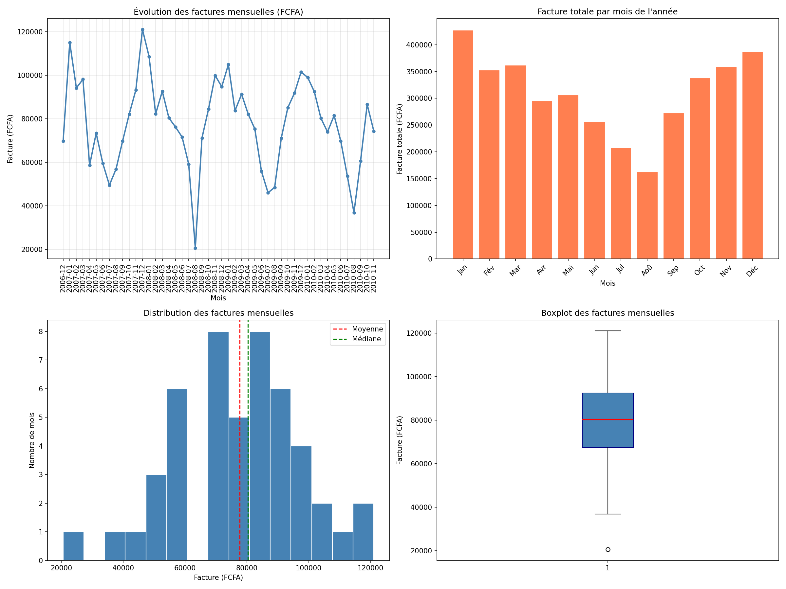

# projet-cie-factures
Analyse des Factures Clients — Contexte CIE
:
Analyse des factures clients | Python • Pandas • Matplotlib | Contexte CIE Abidjan 🇨🇮


## 📌 Description

Analyse des factures électriques mensuelles calculées à partir
de 2 millions de mesures réelles sur 4 ans (2006-2010).

Ce projet simule les analyses réalisées par un Data Analyst
à la **CIE (Compagnie Ivoirienne d'Électricité)** pour le
suivi de la facturation clients.

---

## 🎯 Questions métier

| Question | Type d'analyse |
|----------|---------------|
| Quelle est la facture mensuelle moyenne ? | Univariée |
| Y a-t-il des mois où les factures explosent ? | Temporelle |
| La facture varie-t-elle selon les saisons ? | Bivariée |
| Y a-t-il des anomalies de facturation ? | Détection outliers |

---

## 🔢 Formule de calcul

kWh = Global_active_power (kW) × (1/60) heure
Facture (FCFA) = kWh × 100 FCFA/kWh

---

## 📁 Structure du projet

projet-cie-factures/
├── data/
│   └── household_power_consumption.txt
├── outputs/
│   └── factures_mensuelles.png
├── analyse_factures_cie.ipynb
├── requirements.txt
├── instructions.txt
└── README.md

---

## 🔍 Résultats clés

### Statistiques
- Facture mensuelle **médiane** : ~80 000 FCFA
- Facture **maximale** : ~121 000 FCFA (Janvier 2007)
- Facture **minimale** : ~20 569 FCFA (Août 2008 — outlier)
- Distribution **symétrique** → données stables et prévisibles

### Pattern saisonnier
- **Janvier et Décembre** → mois les plus chers (~115 000 FCFA)
- **Juillet et Août** → mois les moins chers (~50 000 FCFA)
- Écart hiver/été → **facteur 2.5x**

### Anomalie détectée
- **Août 2008** → facture anormalement basse (20 569 FCFA)
- Nombre de mesures normal → absence prolongée des occupants

---

## 📊 Visualisations



---

## 💡 Recommandations CIE

1. Utiliser **80 000 FCFA** comme facture de référence mensuelle
2. **Alerter** si facture < 35 000 ou > 120 000 FCFA
3. **Anticiper** les pics de revenus en janvier
4. **Investiguer** les abonnés avec factures anormalement basses

---

## 🛠️ Technologies utilisées

- **Python 3** — langage principal
- **Pandas** — manipulation et calcul des données
- **Matplotlib** — visualisations
- **Jupyter Notebook** — environnement d'analyse

---

## ▶️ Comment reproduire ce projet

```bash
# 1. Cloner le repo
git clone git@github-kaynordata:Kaynor-Data/projet-cie-factures.git

# 2. Créer l'environnement virtuel
python -m venv venv
venv\Scripts\activate

# 3. Installer les dépendances
pip install -r requirements.txt

# 4. Lancer Jupyter
jupyter notebook
```

---

## 👤 Auteur

**Beh Konaté** — Data Analyst en formation
🔗 [GitHub](https://github.com/Kaynor-Data)
🎥 [YouTube](https://www.youtube.com/@KaynorData)
📧 kaynordata@gmail.com